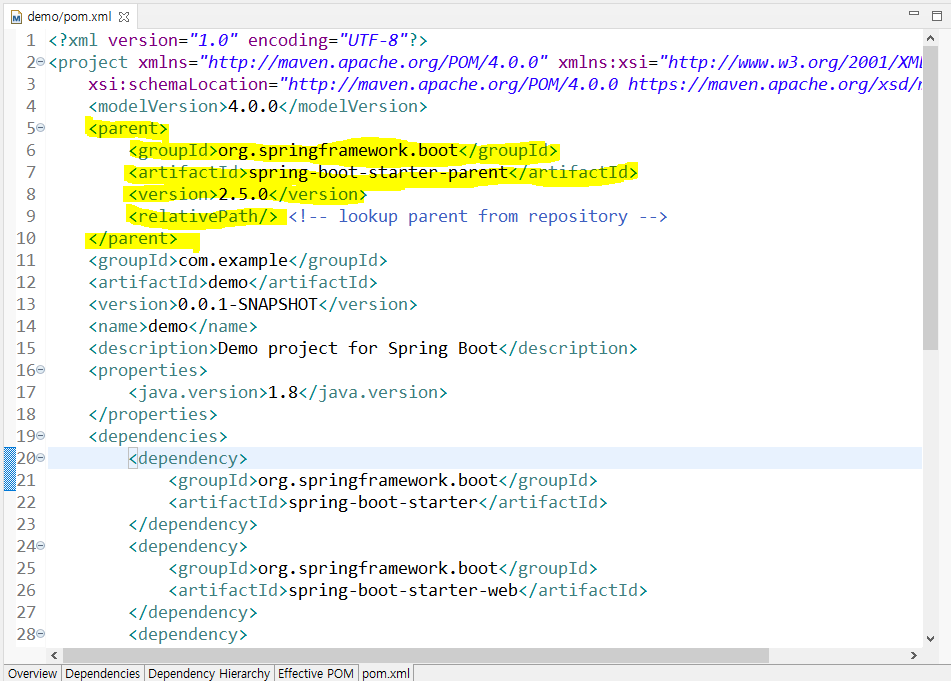
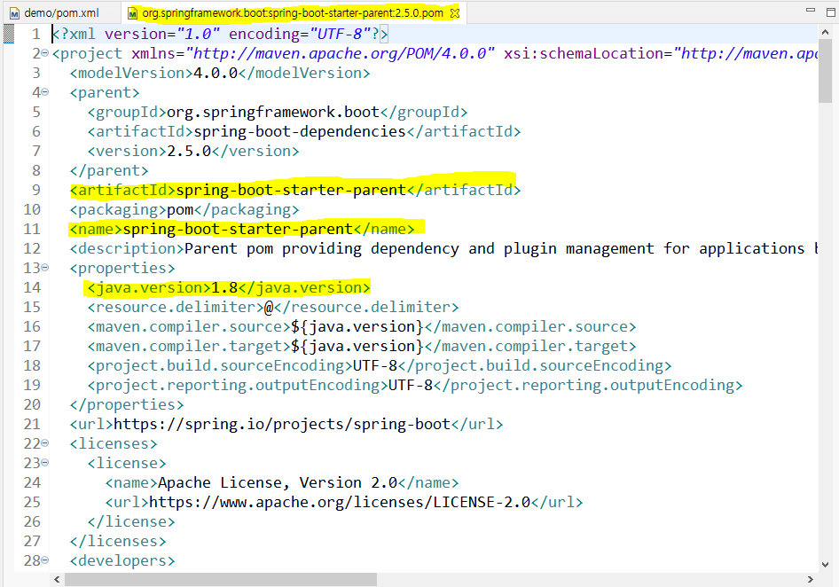

- Spring Boot의 빌더로 maven을 선택하면 pom.xml에 parent태그가 있는것을 확인할 수 있다. 
- pom.xml에 maven 의존성이 정의되어 있긴하지만 유저가 이를 모듈화해서 관리하는것이 가능하다. 
- 이렇게 분리된 maven 의존성을 관리할 수 있도록 하는게 parent tag다.
- 사용자는 parent 태그를 통해 pom.xml이 다른 의존성을 상속받도록 한다. Spring Boot의 경우 아래 사진과 같이 상속받는 것을 알 수 있다.

----

### 참고 사이트

[https://m.blog.naver.com/PostView.nhn?isHttpsRedirect=true&blogId=vefe&logNo=221449828237](https://m.blog.naver.com/PostView.nhn?isHttpsRedirect=true&blogId=vefe&logNo=221449828237)
